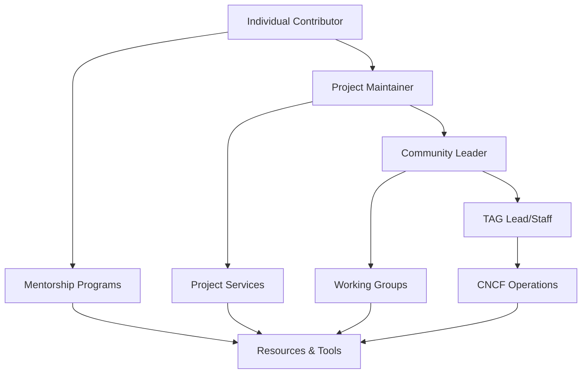

# Content Mapping Strategy: New Information Architecture

## Overview

This document maps content from `cncf/tag-contributor-strategy/website` to the new information architecture for contribute.cncf.io, following the principles established in the "ALL THE DOCS~" meeting notes.

## New Information Architecture

### Service Design Mindset
**Core Principle:** "We provide projects a service"

### Target Audiences & Their Paths
1. **CNCF project maintainers** (sandbox → incubating → graduated)
2. **CNCF Staff and new staff onboarding**
3. **TAG leads and participants**
4. **Mentorship candidates**
5. **People looking to donate projects**

## Content Mapping by New Categories

### 1. **Maintainers** (The Individual)

**Definition:** Individual contributor guidance and personal development paths

#### Content Mapping:
| Source Content | Target Location | Migration Type | Priority |
|----------------|-----------------|----------------|----------|
| `contributors/_index.md` | `/docs/contributors/` | Direct migration | HIGH |
| `contributors/getting-started.md` | `/docs/contributors/getting-started.md` | Update & enhance | HIGH |
| `contributors/projects.md` | `/docs/contributors/projects.md` | Merge with existing | MEDIUM |
| **Individual sections from maintainers guides** | `/docs/maintainers/individual/` | Extract & reorganize | HIGH |

#### New Content Needed:
- **Personal Development Paths:** Career progression for contributors
- **Individual Skills Assessment:** Self-evaluation tools
- **Mentorship Integration:** Personal mentorship guidance
- **Individual Recognition:** Contributor achievement paths

#### Content Enhancements:
- **Getting Started Guide:** Expand with clearer individual paths
- **Project Selection:** Help individuals choose projects to contribute to
- **Skill Building:** Technical and soft skills development

### 2. **Projects** (The Group)

**Definition:** Project-level guidance, governance, and lifecycle management

#### Content Mapping:
| Source Content | Target Location | Migration Type | Priority |
|----------------|-----------------|----------------|----------|
| `maintainers/governance/` | `/docs/projects/governance/` | Direct migration | HIGH |
| `maintainers/community/project-health.md` | `/docs/projects/health/` | Reorganize | HIGH |
| `maintainers/community/recruiting-playbook.md` | `/docs/projects/community/recruiting.md` | Direct migration | HIGH |
| `maintainers/community/vendor-neutrality.md` | `/docs/projects/governance/vendor-neutrality.md` | Move location | HIGH |
| `maintainers/security/` | `/docs/projects/security/` | Direct migration | MEDIUM |
| `maintainers/templates/governance-*.md` | `/docs/projects/templates/governance/` | Reorganize | HIGH |

#### New Content Structure:
```
/docs/projects/
├── lifecycle/
│   ├── sandbox-requirements.md
│   ├── incubating-requirements.md
│   ├── graduation-requirements.md
│   └── project-donation.md
├── governance/
│   ├── overview.md (from maintainers/governance/overview.md)
│   ├── charter.md (from maintainers/governance/charter.md)
│   ├── leadership-selection.md (from maintainers/governance/leadership-selection.md)
│   └── vendor-neutrality.md (from maintainers/community/vendor-neutrality.md)
├── health/
│   ├── metrics.md (from maintainers/community/project-health.md)
│   └── assessment-tools.md
├── community/
│   ├── recruiting.md (from maintainers/community/recruiting-playbook.md)
│   ├── growth-framework/ (from maintainers/community/contributor-growth-framework/)
│   └── crm-runbook.md (from maintainers/community/crm-runbook.md)
├── security/
│   └── (content from maintainers/security/)
└── templates/
    ├── governance/ (from maintainers/templates/governance-*.md)
    ├── contributing.md (from maintainers/templates/contributing.md)
    ├── maintainers.md (from maintainers/templates/maintainers.md)
    └── issue-labels.md (from maintainers/templates/issue-labels.md)
```

#### Content Enhancements:
- **Project Lifecycle Guidance:** Clear paths for project maturity
- **Service Integration:** How projects access CNCF services
- **Cross-Project Collaboration:** Inter-project working

### 3. **Community** (The Group of Groups)

**Definition:** Cross-project initiatives, organizational guidance, and community-wide programs

#### Content Mapping:
| Source Content | Target Location | Migration Type | Priority |
|----------------|-----------------|----------------|----------|
| `about/working-groups/` | `/docs/community/working-groups/` | Reorganize | MEDIUM |
| `accessibility/` | `/docs/community/accessibility/` | Direct migration | HIGH |
| `about/_index.md` | `/docs/community/tag-contributor-strategy/` | Reorganize | LOW |
| **Cross-project initiatives** | `/docs/community/initiatives/` | New organization | MEDIUM |

#### New Content Structure:
```
/docs/community/
├── working-groups/
│   ├── contributor-growth.md
│   ├── governance.md
│   ├── mentoring.md
│   ├── maintainers-circle.md
│   ├── blind-and-visually-impaired.md
│   └── deaf-and-hard-of-hearing.md
├── accessibility/
│   ├── _index.md (from accessibility/_index.md)
│   ├── blind-and-visually-impaired/ (from accessibility/blind-and-visually-impaired/)
│   └── deaf-and-hard-of-hearing/ (from accessibility/deaf-and-hard-of-hearing/)
├── initiatives/
│   ├── maintainers-circle.md
│   ├── contributor-summit.md
│   └── cross-project-collaboration.md
├── staff/
│   ├── onboarding.md
│   ├── project-liaison.md
│   └── tag-coordination.md
└── tag-leads/
    ├── responsibilities.md
    ├── coordination.md
    └── resources.md
```

#### New Content Needed:
- **CNCF Staff Onboarding:** Comprehensive staff guidance
- **TAG Lead Resources:** Leadership resources for TAG chairs
- **Cross-Project Coordination:** How projects work together
- **Community Events:** Summit planning, event coordination

### 4. **Resources & Services**

**Definition:** Tools, services, documentation, and supporting materials

#### Content Mapping:
| Source Content | Target Location | Migration Type | Priority |
|----------------|-----------------|----------------|----------|
| `resources/glossary.md` | `/docs/resources/glossary.md` | Direct migration | HIGH |
| `resources/how-to/` | `/docs/resources/how-to/` | Direct migration | MEDIUM |
| `resources/project-services/` | `/docs/resources/services/` | Enhance | HIGH |
| `resources/videos/` | `/docs/resources/videos/` | Reorganize | MEDIUM |
| `resources/newsletters/` | `/docs/resources/newsletters/` | Archive | LOW |
| `resources/todogroup_resources.md` | `/docs/resources/external/todogroup.md` | Reorganize | LOW |
| `maintainers/templates/reviewing.md` | `/docs/resources/templates/reviewing.md` | Move location | MEDIUM |

#### Enhanced Content Structure:
```
/docs/resources/
├── services/
│   ├── cncf-support/ (enhanced from project-services/cncf-support/)
│   ├── hosted-tools/ (from project-services/hosted-tools/)
│   ├── technical-writing/ (from project-services/technical-writing/)
│   ├── audits/ (from project-services/audits/)
│   └── outreach-events/ (from project-services/outreach-events/)
├── tools/
│   ├── project-health-tools.md
│   ├── governance-templates.md
│   └── community-management.md
├── how-to/
│   ├── (content from resources/how-to/)
│   ├── change-affiliation.md (from how-to/change-affiliation.md)
│   ├── change-email.md (from how-to/change-email.md)
│   └── submit-license-exception.md (from how-to/submit-license-exception-request.md)
├── templates/
│   ├── project/ (governance templates)
│   ├── community/ (community templates)
│   └── individual/ (contributor templates)
├── glossary.md (from resources/glossary.md)
├── videos/ (organized by topic, not year)
├── newsletters/ (archived)
└── external/
    └── todogroup.md (from todogroup_resources.md)
```

#### Service Integration:
- **Mentorship Programs:** Clear pathways to mentorship
- **CNCF Services:** How to access support, tools, events
- **External Resources:** Curated links to valuable external content

## Cross-Cutting Concerns

### Canonical Source Strategy

**Principle:** Single source of truth for each topic

#### Identified Overlaps:
1. **Governance Templates:** 
   - Source: `maintainers/templates/governance-*.md`
   - Canonical: `/docs/projects/templates/governance/`
   - Cross-references: Link from resources and individual guidance

2. **Contributor Growth Framework:**
   - Source: `maintainers/community/contributor-growth-framework/`
   - Canonical: `/docs/projects/community/growth-framework/`
   - Cross-references: Link from individual contributor guides

3. **Accessibility Guidelines:**
   - Source: `accessibility/`
   - Canonical: `/docs/community/accessibility/`
   - Cross-references: Link from all other sections

### Strong Cross-Referencing Strategy

#### Reference Patterns:
- **Individual → Project:** "Ready to maintain a project? See [Project Governance](/docs/projects/governance/)"
- **Project → Community:** "Connect with other projects through [Community Initiatives](/docs/community/initiatives/)"
- **Community → Services:** "Access CNCF support through [Project Services](/docs/resources/services/)"
- **Services → Individual:** "New to contributing? Start with [Getting Started](/docs/contributors/getting-started/)"

### Content Relationship Map



## Migration Principles Application

### 1. Correctness over Longevity
- **Content Review:** All migrated content will be reviewed for accuracy
- **Update Strategy:** Outdated content will be updated or deprecated
- **Validation:** Subject matter experts will validate technical content

### 2. Strong Cross-Referencing
- **Bidirectional Links:** Related content will link to each other
- **Context-Aware Navigation:** Users will see relevant next steps
- **Progressive Disclosure:** Basic → intermediate → advanced content paths

### 3. Canonical Source Approach
- **Single Source:** Each topic will have one authoritative location
- **Redirect Strategy:** Old locations will redirect to canonical sources
- **Link Management:** All internal links will point to canonical sources

### 4. Service Design Mindset
- **User Journey Mapping:** Content organized by user needs, not organizational structure
- **Clear Value Proposition:** Each section clearly states what service it provides
- **Outcome-Focused:** Content organized around what users want to achieve

## Implementation Priorities

### Phase 1: Foundation (Weeks 1-2)
- Migrate high-priority individual contributor content
- Set up new information architecture structure
- Establish canonical sources for templates

### Phase 2: Core Services (Weeks 3-4)
- Migrate project-level guidance and templates
- Implement strong cross-referencing
- Update existing content to match new IA

### Phase 3: Community Integration (Weeks 5-6)
- Migrate community and accessibility content
- Add new staff and TAG lead content
- Integrate mentorship pathways

### Phase 4: Resources & Polish (Weeks 7-8)
- Migrate supporting resources and tools
- Complete cross-referencing
- Final content review and optimization

## Success Metrics

- **Content Completeness:** All identified content successfully migrated
- **User Journey Clarity:** Clear paths for each target audience
- **Cross-Reference Coverage:** Comprehensive internal linking
- **Search Effectiveness:** Improved findability of content
- **User Feedback:** Positive response from target audiences